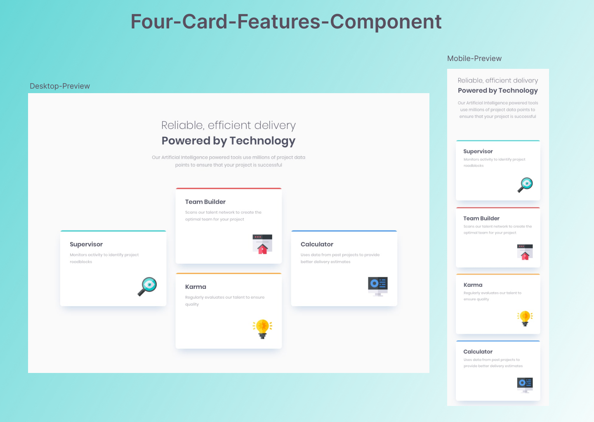

# Four-Card-Features-Component (grid,flexbox)
   

## Hey there 👋, thanks for visiting.
  It contains my solution to "Frontend Mentor's" challenge which you can try [here](https://www.frontendmentor.io/challenges/four-card-feature-section-weK1eFYK).
  You need basic understanding of HTML,CSS and/or JS.

## Learnings
* Arranging cards properly using cssgrid.
* Using grid to make site responsive.
